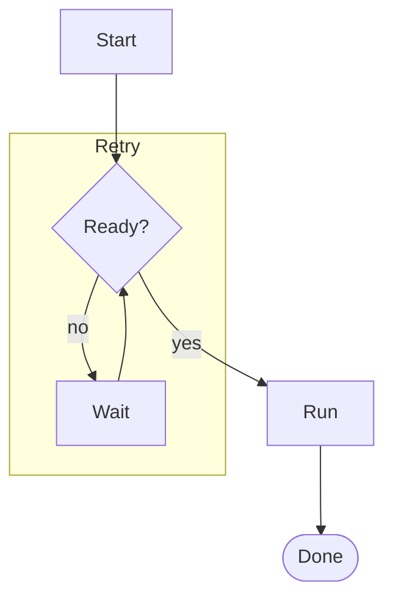
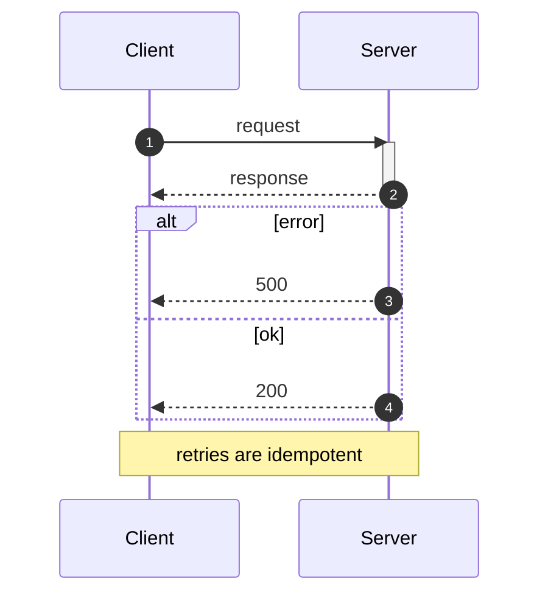
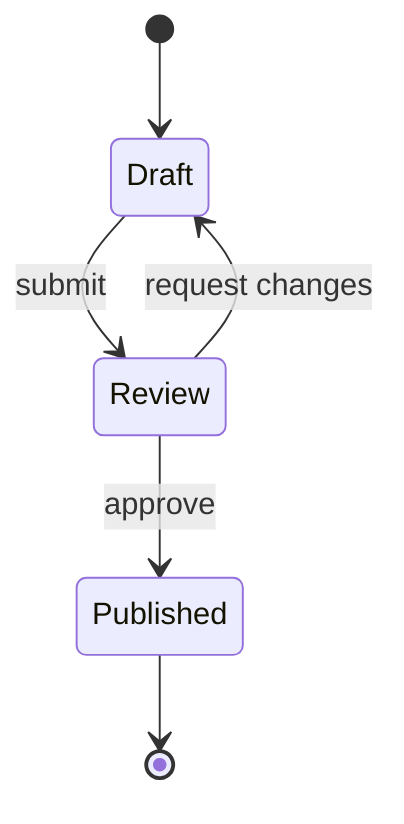
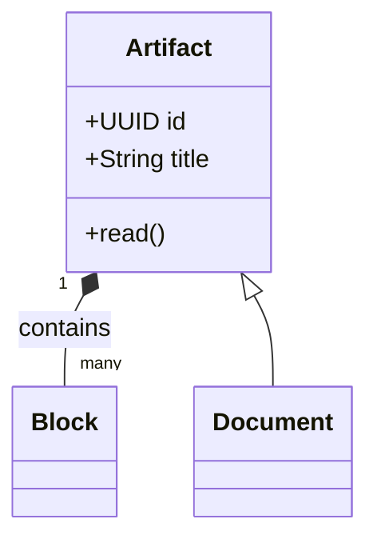
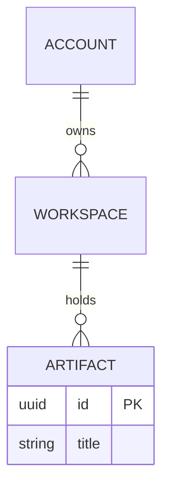

# Mermaid diagrams in Sosein

A diagram in Sosein is a `sosein/diagram` Literate Object. Its payload has two
fields: `dialect`, which must be exactly `mermaid` (lowercase), and `source`,
the diagram text. Sosein stores the source and the Doc app renders the picture
with Mermaid 11. Nothing validates the source on write, so a syntax error is
stored and shown as an error block until someone fixes the source.

## Getting a diagram into an artifact

- **New artifact**: put a ```` ```mermaid ```` fence in
  `sosein_create_from_markdown.source_markdown`. Sosein lowers the fence to a
  placed diagram object at birth on `document`, `note`, and `record` types.
  `sosein_create_artifact` refuses the fence; it has no source-Markdown path.
- **Existing artifact**: call `sosein_create_object` with
  `object_type: "sosein/diagram"`, `schema_version: 1`,
  `fields: {"dialect": "mermaid", "source": "<diagram text>"}`, and a
  block-class placement: `{kind: "after_block", block_id: "b:…", label}` or
  `{kind: "document_start", label}`. The label is the diagram's visible name;
  keep it short and single-line. Inline placement is refused.
- **Changing a diagram**: call `sosein_read_object` on its `o:` id, then
  `sosein_edit_object` with `update_field` on `source`. Never paste a mermaid
  fence into `sosein_edit_artifact` or `sosein_edit_blocks`; both refuse it and
  name the object tools.
- **Reading**: a placed diagram reads as `[Label](sosein:diagram#o:…)`. The
  source is only in `sosein_read_object`.

## What the renderer refuses

The Doc app runs Mermaid with `securityLevel: 'strict'`, `htmlLabels: false`,
and a locked theme. Write for that:

- No `click`, `call`, `href`, or callback lines. They are stripped or fail.
- No HTML in labels. Tags are not rendered as HTML; only `<br/>` survives, as
  a line break. Prefer short labels over any other markup.
- No `%%{init: {...}}%%` directives that set `theme`, `themeVariables`,
  `themeCSS`, `securityLevel`, `htmlLabels`, or `maxEdges`. They are ignored.
  The document supplies the palette, so the diagram matches light and dark
  mode without any theme work.
- Stay under 50,000 characters of source and 500 edges. Larger sources are a
  parse error.

## Syntax that renders reliably

Start every source with the diagram keyword on its own line. Comments start
with `%%` on their own line.

### Flowchart (default choice for structure and flow)



- Direction: `TD` (top-down), `LR` (left-right), `BT`, `RL`.
- Shapes: `[box]`, `(rounded)`, `([stadium])`, `{diamond}`, `[(database)]`,
  `((circle))`, `>flag]`, `[[subroutine]]`.
- Edges: `-->` arrow, `---` line, `-.->` dotted, `==>` thick, `-- text -->`
  or `-->|text|` for a label.
- Quote any label that contains `(`, `)`, `[`, `]`, `{`, `}`, `|`, `#`, `;`,
  or a keyword: `A["Deploy (prod)"]`.
- `end` is reserved. Do not use it as a bare node id; write `E[end]` or quote.
- Node ids are case-sensitive and must not contain spaces.

### Sequence diagram (interactions over time)



- Arrows: `->>` solid with arrowhead, `-->>` dashed, `-x` lost message,
  `-)` async.
- Blocks: `loop`, `alt`/`else`, `opt`, `par`/`and`, `critical`, `break`,
  each closed by `end`.
- A message text cannot contain `;`. Use a comma or a second message.

### State diagram



Use `stateDiagram-v2`, not `stateDiagram`. State names with spaces need an
alias: `state "In review" as Review`.

### Class diagram



Relations: `<|--` inheritance, `*--` composition, `o--` aggregation, `-->`
association, `..>` dependency.

### Entity relationship diagram



Cardinality: `||` exactly one, `o|` zero or one, `}|` one or more, `}o` zero
or more. Entity names must be single words or quoted.

### Other types

- `gantt` for schedules. Needs `dateFormat` and one `section`; each task line
  is `name : id, start, duration`.
- `pie` for shares: `pie title Share` then `"Label" : 42` lines.
- `mindmap` and `timeline` for outlines. Indentation is structure.
- `gitGraph` for branch histories: `commit`, `branch x`, `checkout x`,
  `merge x`.
- `quadrantChart`, `xychart-beta`, `sankey-beta`, `block-beta`, and
  `architecture-beta` also render, but their grammar changes between Mermaid
  releases. Prefer the types above unless the user asks.

## Authoring workflow

1. Choose the type by the question the picture answers: flow or structure →
   flowchart; who-talks-to-whom over time → sequence; lifecycle → state;
   data model → class or ER.
2. Keep one diagram to one idea and under about 25 nodes. Split a larger
   picture into several diagrams, each with its own label.
3. Write labels as short noun phrases. Put explanation in the surrounding
   prose, not inside the diagram.
4. Mentally parse the source line by line before writing it: every block that
   opens (`subgraph`, `alt`, `loop`, `par`, `opt`, `critical`, `break`) is
   closed by `end`, every quoted label is closed, and every id used in an edge
   was spelled the same way everywhere.
5. After writing, read the object back and confirm the source is what you
   meant. If the user reports an error block, the message on the block is
   Mermaid's parser diagnostic; fix the named line with `sosein_edit_object`.
